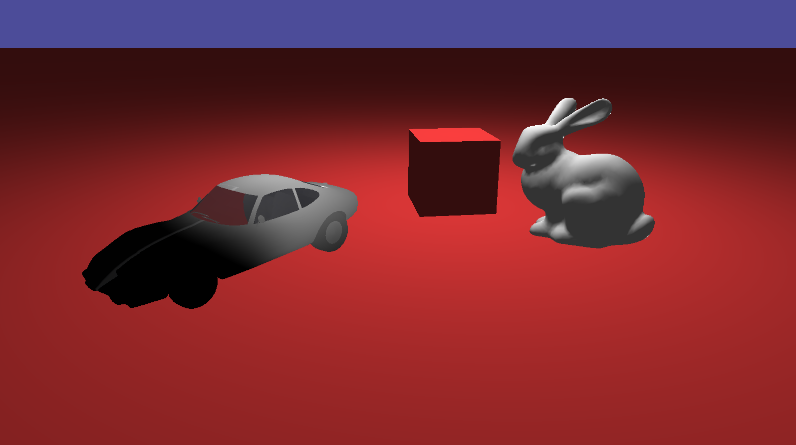

# qun

This is an attempt to make a simple game engine / renderer using modern OpenGL (4.5) and C++ (23)

## Why?

- To finally properly learn OpenGL, instead of jumping straight into newer abstractions like [wgpu](https://github.com/gfx-rs/wgpu)
- As an exercise in writing idiomatic, modern C++, as I mostly write Rust

## Features

- GLSL Shader Hotreloading
- Dynamic entity manipulation making use of [EnTT](https://github.com/skypjack/entt)
- Support for meshes with multiple materials
- Obj and glTF file formats for asset imports
- Heavy use of ECS paradigms (plugins, systems, resources)
- Use of results (`std::expected`) over traditional C++ exceptions

## Sample



```cpp
int main() {
  auto game = std::make_unique<Game>();
  game->addPlugin(DefaultPlugins());
  game->addPlugin(plugins::DebugCamController());
  game->addSystem(Schedule::Startup, scenes::test::startup);
  game->addSystem(Schedule::Update, scenes::test::update);

  auto result = game->start();
  if (!result.has_value()) {
    std::println(stderr, "Failed to start game: {}", result.error());
    return EXIT_FAILURE;
  }

  return EXIT_SUCCESS;
}
```

## Building

1. You **must** clone the repository with submodules, as most dependencies are submodules.

```sh
git clone https://github.com/DvvCz/qun --recurse-submodules
```

2. Ensure you have system dependencies. This relies on `opengl`, `glm` and `glfw` which you may need to install development packages for on your system.

3. To build, configure with [`CMake`](https://cmake.org) and build with [`Ninja`](https://ninja-build.org).

I recommend doing your configuration via your IDE, I use VSCode.
Later on there may be build artifacts served via GitHub if I get around to it.

## Troubleshooting

| Error | Solution |
| --- | --- |
| `libdecor-gtk-WARNING: Failed to initialize GTK.` | Either run the program outside VSCode or force VSCode to use Wayland (`code --enable-features=UseOzonePlatform --ozone-platform=wayland`) |
