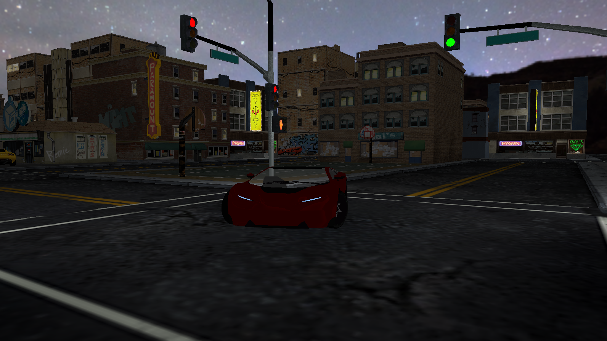

# trender

This is an attempt to make a relatively simple renderer using modern OpenGL (4.5) and C++ (23)

## Features

- GLSL Shader Hotreloading
- Dynamic entity manipulation making use of [EnTT](https://github.com/skypjack/entt)
- Support for meshes with multiple materials
- Obj and glTF file formats for asset imports

## Sample

## Building

This project uses [`CMake`](https://cmake.org) and [`Ninja`](https://ninja-build.org).
I recommend doing your configuration via your IDE, I use VSCode.

Later on there may be build artifacts served via GitHub if I get around to it.

## Troubleshooting

| Error | Solution |
| --- | --- |
| `libdecor-gtk-WARNING: Failed to initialize GTK.` | Either run the program outside VSCode or force VSCode to use Wayland (`code --enable-features=UseOzonePlatform --ozone-platform=wayland`) |
